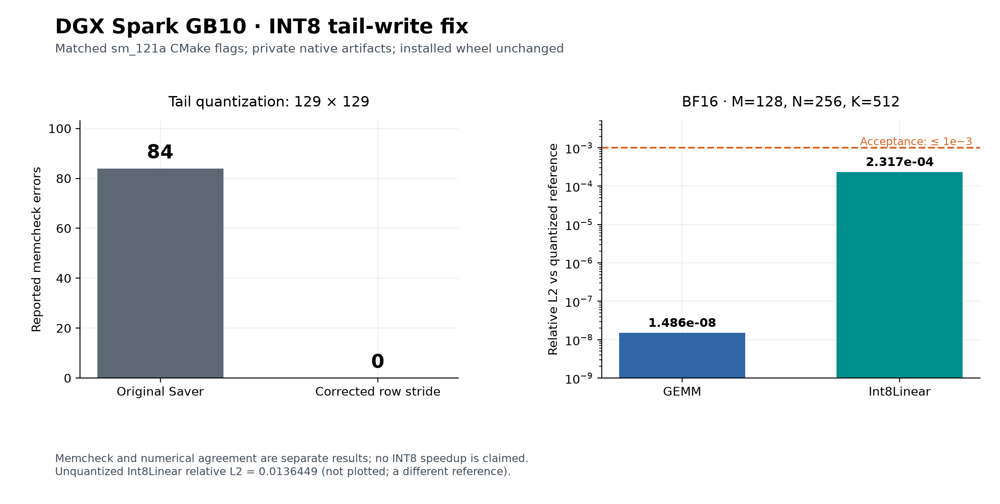
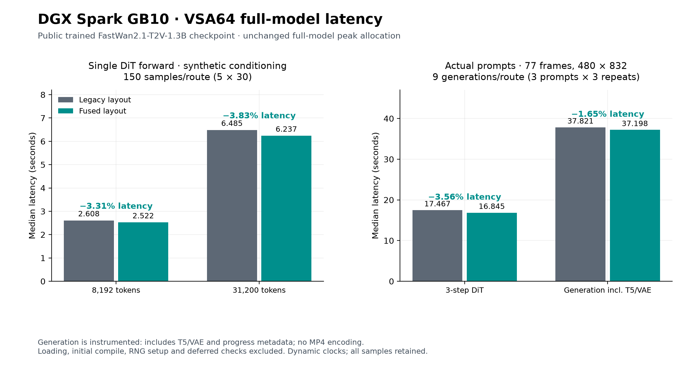
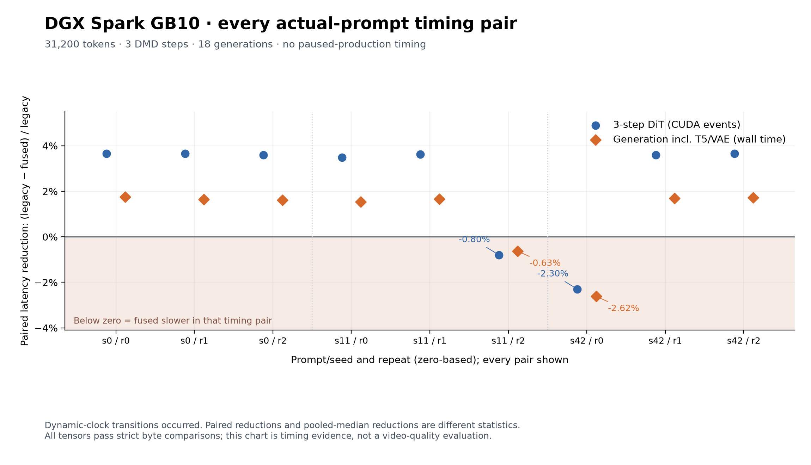

# DGX Spark GB10: INT8 and VSA64 numerical results

Results and four static figures from the completed GB10 experiments. Hardware: aarch64, CUDA capability `(12,1)`, CUDA 13.0.88, Torch 2.12.0+cu130, Triton 3.7.0. FastVideo baseline: `2b164405c3d15ed2d222d0582d6db09ffc5ee6b2`.

This public package contains numerical exports, all 1818 timing rows, PNG/SVG figures and CPU scripts. The original logs, telemetry, source snapshots, internal path metadata, tensors and weights remain in the local experiment archive. Removing non-numerical CSV columns does not remove any timing sample.

## INT8 tail fix

| Numerical check | Result |
| --- | --- |
| BF16 `[129,129]` memcheck with matched production flags | **84 errors → 0** |
| FP16/BF16 tail/random/constant quantization | **36 cases** match independent CPU reference exactly, including FP32 scales |
| TurboDiffusion regression / separate CPU reference | **63 / 6 passed** |
| GEMM relative L2 vs quantized reference | **1.486012343e-8**, finite |
| Int8Linear relative L2 vs quantized reference | **2.316898312e-4**, finite |
| Int8Linear relative L2 vs unquantized linear | **0.01364490189**, a different reference |



The quantized-reference criterion is relative L2 ≤ `1e-3`, not byte equality for GEMM/Int8Linear. Private quant/GEMM artifacts used matched production CUDA flags and CUTLASS `e67e63c331d6e4b729047c95cf6b92c8454cba89`; unchanged norm cases used the installed extension. This is not a complete rebuilt-wheel certification. The `[129,241]` initcheck probe reports zero errors but reads outputs on CPU, so complete GPU initialization is not certified. The historical aligned-512 crash was not reproduced; unsupported GEMM-shape rejection handling remains outside the fix. No INT8 speedup is claimed.

## VSA64 numerical results

The tested change enables the existing fused layout on GB10, retaining its tile-64/BF16/D128/inference/full-sequence/cache guards and kill switch. The layout and sparse attention kernel computations are unchanged.

- **30** numerical cases and **8** additional H40 cases agree exactly across tails, long sequences, seeds 0/11/42, noncontiguous inputs and buffer reuse. H40 performance/memory peaks were not instrumented.
- Four positive layout memcheck/initcheck controls report zero errors; an independent GPU reader checks valid and padded slots, with an omitted-store negative control detecting the expected error. Memory diagnostics are separate from numerical checks.
- Six complete trained-DiT cases at 8192/31200 tokens agree exactly. Public checkpoint: `FastVideo/FastWan2.1-T2V-1.3B-Diffusers`, revision `25e7ed7f41fd8ce2fdd108688c65e8caf0ce3aef`, 885 parameter tensors, 60 trained gate tensors and 30 VSA blocks.
- **18 measured prompt generations**, 54 DiT steps and 1620 ordered VSA events: paired step inputs/outputs, timesteps, final latents, raw decoder outputs, normalized outputs and RNG fingerprints agree exactly and are finite.
- Separate production routing validation uses the actual GB10 gate and automatic Triton fallback without overriding eligibility/backend. A real 31200-token prompt pair agrees exactly; existing GPU regression is **11 passed, 0 skipped**. Private diagnostic CPU suites pass **120 + 54** checks, not additional public CI coverage.

## VSA64 latency

These are reductions of route medians, `100 × (1 − fused/legacy)`, with all timing samples retained.

| Scope | Legacy median | Fused median | Reduction |
| --- | --- | --- | --- |
| Full trained DiT, synthetic conditioning, 8192 tokens | 2607.784 ms | 2521.559 ms | **3.306%** |
| Full trained DiT, synthetic conditioning, 31200 tokens | 6485.170 ms | 6236.700 ms | **3.831%** |
| Three DiT steps, actual prompts, 31200 tokens | 17467.208 ms | 16845.215 ms | **3.561%** |
| Instrumented generation including T5/VAE | 37.821364 s | 37.197883 s | **1.648%** |



Formal single-forward benchmarks use 5 warmups, 30 timed iterations and 5 rounds: 150 samples per route/length. Actual prompt measurements use 77 frames at 480×832, three DMD steps `[1000,757,522]`, guidance 1, TeaCache off, resident T5/DiT/VAE and three prompts/seeds × three repeats × two routes. Full-pipeline allocated/reserved peaks are unchanged at **31.951 / 34.098 GiB**.

Clocks varied. All nine timing pairs are visible below, including two slower fused pairs. Reductions of means are **2.466% DiT / 0.925% generation**, distinct from the median reductions above.



[Five-round figure](figures/vsa64-five-round-full-dit.png) retains the first 8192-token clock transition. These are not fixed-clock or every-sample speedup claims. All performance samples are from no-pause pre-production equivalence runs. The actual default production route was checked separately; its **366.503-second pacing pauses** exclude it from performance comparisons. Generation time includes T5, denoise, VAE, observer metadata, synchronization and progress writes; loading, initial compilation, RNG setup, deferred checks/hashing and MP4 encoding are excluded. DiT uses a narrower CUDA-event scope.

The numerical checks establish byte-preserving inference in the tested scope on this GB10. Independent video quality, long-term convergence, 14B and other-device performance are unverified; historical QAT/R5 failures remain unchanged.

## Download and redraw

[Numerical summary](numerics/numerical_summary.json), [statistics CSV](numerics/performance_statistics.csv), [all prompt pairs](numerics/pipeline_paired.csv), [all timing exports](data), [captions](figures/CAPTIONS.txt) and [figure input/export hashes](figures/figure-manifest.json) are included. [SHA256SUMS](SHA256SUMS) verifies the public package.

From this directory:

```bash
sha256sum --check SHA256SUMS
python scripts/summarize_results.py --data-dir data --output-dir /tmp/gb10-numerics
python -m venv /tmp/gb10-plot-env
/tmp/gb10-plot-env/bin/pip install -r scripts/requirements-plot.txt
/tmp/gb10-plot-env/bin/python scripts/generate_figures.py \
  --source-root data --output-dir /tmp/gb10-figures
```

These commands recreate numerical timing statistics and figures on CPU. They do not perform new GPU measurements or reconstruct tensor evidence. The numerical-only inputs reproduce the same eight PNG/SVG image bytes as the original experiment plots.
